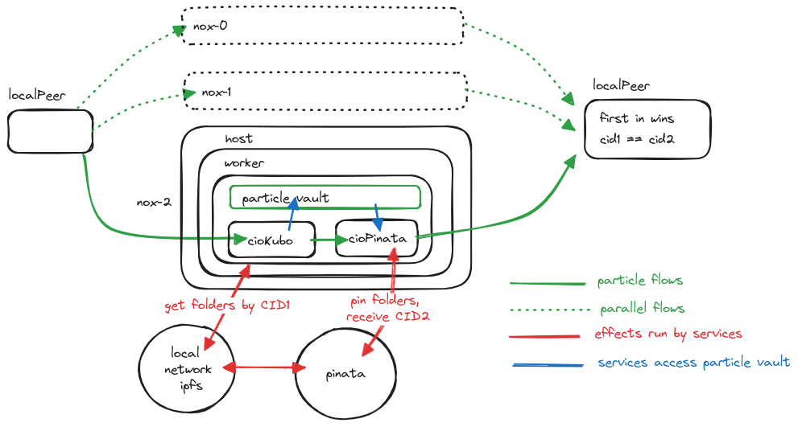

This repo demonstrates: 

* how you can write custom effectors and use them on a local network, where you can whitelist them yourself. 
* the use of Pinata to down- and upload folders with files to and from the particle vault. Using Pinata gateways has the benefit of your content being well indexed and available everywhere. When developing on a local network, it can be convenient to keep your data somewhere persistent. 



This project symlinks to two services and two effectors, each with their own repository, that should be cloned as siblings: 

```
git clone https://github.com/composibleIO/cio-curl-effector.git
git clone https://github.com/composibleIO/cio-ipfs-effector.git
git clone https://github.com/composibleIO/cio-kubo.git
git clone https://github.com/composibleIO/cio-pinata.git

git clone https://github.com/composibleIO/custom-effector-test.git
cd custom-effector-test
```

```
fluence update --version 0.15.28
fluence dep i
fluence local up
fluence deploy
```

You may want to get the archive onto your local networks ipfs peer. The ipfs effector has a  timeout set to 30s, which may not be enough at first try. 

```
docker exec -ti fluence-ipfs-1 ipfs get <cid>
```

Run the test:

```
fluence run -f 'test("<yourPinataJWT>")'
```

Our aqua script will be downloading a contentadressed folder of files from a Pinata gateway into the particle vault, then log its contents, and then re-upload them to Pinata. The returned CID should be equal to the archive cid. 


